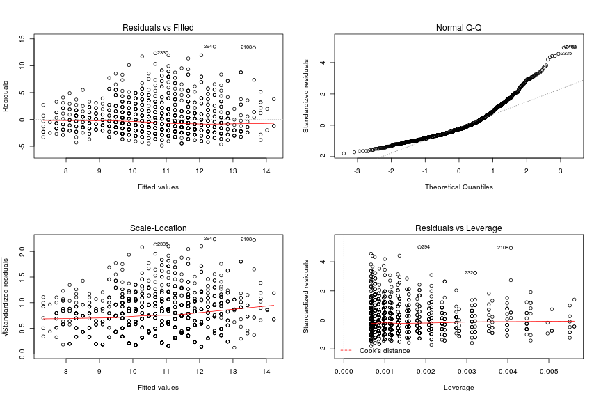
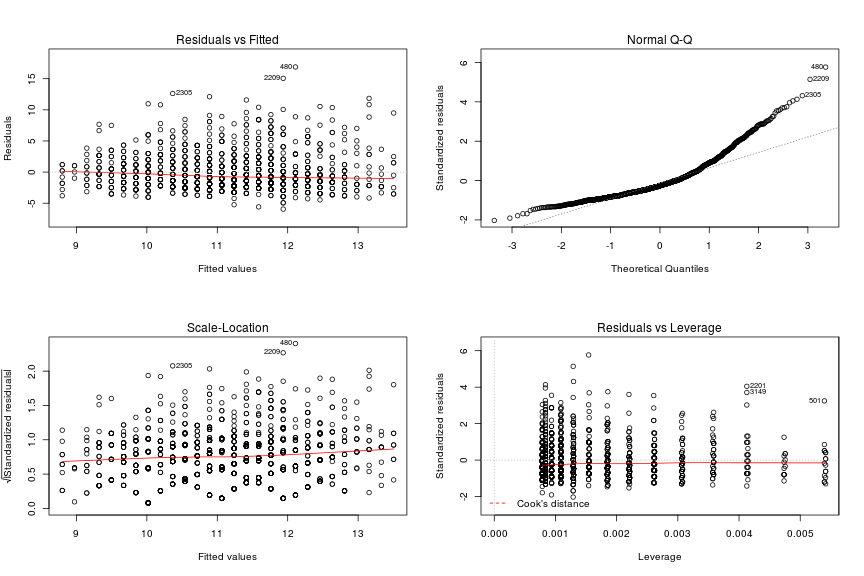
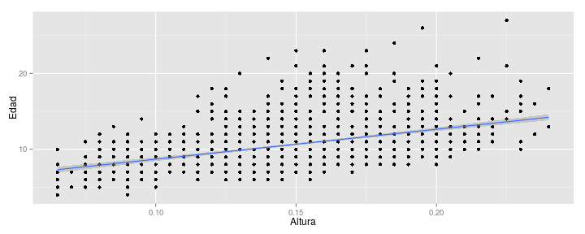

Dimensiones y crecimiento de los abulones
=========================================

Propósito: aplicar herramientas de estadística descriptiva & de inferencia para analizar un data set obtenido del UCI Machine Learning Archive: https://archive.ics.uci.edu/ml/datasets/Abalone

Lo elegí porque está fácilmente disponible para R, y tiene las dimensiones requeridas para el TP: una buena cantidad de registros (aprox. 4K) y la cantidad justa de variables que se piden (9).

# Descripción

El data set contiene mediciones de especímenes de un bicho llamado *abulón* (al parecer, es un caracol marino de California). Quienes tomaron las mediciones recolectaron los datos para ver si podían predecir la edad del abulón a partir de sus dimensiones, porque eso es más rápido que el método tradicional (i.e. cortarlo por la mitad, teñirlo y contar los anillos internos mediante el microscopio).

### Cargar los datos

Como la tabla viene sin nombres, se los agregamos usando la información que trae la descripción del data set (`data/dataset.names`):


```r
abulones <- read.csv("data/dataset.csv")
names(abulones) <- c("Sexo", "Longitud", "Diámetro", "Altura",
"PesoTotal", "PesoNeto", "PesoVísceras", "PesoCaparazón", "Edad")
```

Aclaración: la edad del abulón es = nro. de Anillos + 1.5, según la descripción. Por eso, en lugar de usar "Anillos" como nombre para la última variable (que es en realidad lo que trae en el data set), uso "Edad". Para nuestros fines, es lo mismo.

### Limpieza

Una mirada rápida a los datos indica que no hay valores 'null' o faltantes, así que sólo resta validar que ni la altura ni el peso total sean negativos:


```r
abulones <- subset(abulones, !(Altura <= 0 | PesoTotal <= 0))
summary(abulones)
```

```
##  Sexo        Longitud        Diámetro         Altura        PesoTotal    
##  F:1307   Min.   :0.075   Min.   :0.055   Min.   :0.010   Min.   :0.002  
##  I:1340   1st Qu.:0.450   1st Qu.:0.350   1st Qu.:0.115   1st Qu.:0.442  
##  M:1527   Median :0.545   Median :0.425   Median :0.140   Median :0.800  
##           Mean   :0.524   Mean   :0.408   Mean   :0.140   Mean   :0.829  
##           3rd Qu.:0.615   3rd Qu.:0.480   3rd Qu.:0.165   3rd Qu.:1.154  
##           Max.   :0.815   Max.   :0.650   Max.   :1.130   Max.   :2.825  
##     PesoNeto      PesoVísceras    PesoCaparazón         Edad      
##  Min.   :0.001   Min.   :0.0005   Min.   :0.0015   Min.   : 1.00  
##  1st Qu.:0.186   1st Qu.:0.0935   1st Qu.:0.1300   1st Qu.: 8.00  
##  Median :0.336   Median :0.1710   Median :0.2340   Median : 9.00  
##  Mean   :0.359   Mean   :0.1807   Mean   :0.2389   Mean   : 9.93  
##  3rd Qu.:0.502   3rd Qu.:0.2530   3rd Qu.:0.3289   3rd Qu.:11.00  
##  Max.   :1.488   Max.   :0.7600   Max.   :1.0050   Max.   :29.00
```

Algunos registros, como ejemplo:


```r
head(abulones)
```

```
##   Sexo Longitud Diámetro Altura PesoTotal PesoNeto PesoVísceras
## 1    M    0.350    0.265  0.090    0.2255   0.0995       0.0485
## 2    F    0.530    0.420  0.135    0.6770   0.2565       0.1415
## 3    M    0.440    0.365  0.125    0.5160   0.2155       0.1140
## 4    I    0.330    0.255  0.080    0.2050   0.0895       0.0395
## 5    I    0.425    0.300  0.095    0.3515   0.1410       0.0775
## 6    F    0.530    0.415  0.150    0.7775   0.2370       0.1415
##   PesoCaparazón Edad
## 1         0.070    7
## 2         0.210    9
## 3         0.155   10
## 4         0.055    7
## 5         0.120    8
## 6         0.330   20
```

Para comodidad, dividimos los abulones por sexo, así podemos hacer operaciones con cada grupo:


```r
machos <- subset(abulones, Sexo == 'M')
hembras <- subset(abulones, Sexo == 'F')
juveniles <- subset(abulones, Sexo == 'I')
```

### Gráficos exploratorios

Ploteamos una de las variables, el PesoTotal:


```r
hist(hembras$PesoTotal, main = "peso total | hembras")
```

 

Parece normal. Queda más claro si

1) lo ploteamos como curva:


```r
plot(density(hembras$PesoTotal))
```

 

2) comparamos con una normal usando Q-Q plot:


```r
qqnorm(hembras$PesoTotal)
qqline(hembras$PesoTotal)
```

 

Un boxplot para ver la dispersión de una variable, la Altura:


```r
boxplot(hembras$Altura)
```

 

Hmmm. Varios *outliers*, y un máximo sospechoso. Es razonable pensar que el proceso de sacarles las entrañas, con los jugos que se pierden en el proceso, etc. ya debe influir un poco en las mediciones, así que mejor reducir la dispersión donde sea posible. Saquemos los valores extremos. Para eso empezamos por calcular los cuartiles:


```r
quantile(machos$Altura)
```

```
##    0%   25%   50%   75%  100% 
## 0.025 0.130 0.155 0.175 0.515
```

```r
quantile(hembras$Altura)
```

```
##    0%   25%   50%   75%  100% 
## 0.015 0.140 0.160 0.175 1.130
```

```r
quantile(juveniles$Altura)
```

```
##      0%     25%     50%     75%    100% 
## 0.01000 0.08875 0.11000 0.13000 0.22000
```

Para no tener que lidiar con *outliers* (sobre todo entre los juveniles, la categoría donde hay más), eliminamos los bichos que estén más allá de los bigotes del boxplot, usando los límites de la caja +/- 1.5 * la distancia intercuartil:


```r
limite_bigote_inferior = 0.140 - (0.175 - 0.140) * 1.5
limite_bigote_superior = 0.175 + (0.175 - 0.140) * 1.5
hembras <- subset(hembras, Altura >= limite_bigote_inferior & Altura <= limite_bigote_superior)

limite_bigote_inferior = 0.130 - (0.175 - 0.130) * 1.5
limite_bigote_superior = 0.175 + (0.175 - 0.130) * 1.5
machos <- subset(machos, Altura >= limite_bigote_inferior & Altura <= limite_bigote_superior)

limite_bigote_inferior = 0.08875 - (0.130 - 0.08875) * 1.5
limite_bigote_superior = 0.08875 + (0.130 - 0.08875) * 1.5
juveniles <- subset(juveniles, Altura >= limite_bigote_inferior & Altura <= limite_bigote_superior)
```

A ver cómo quedó:


```r
par(mfrow=c(1,3))
hist(hembras$Altura, main = "altura (hembras)")
hist(machos$Altura, main = "altura (machos)")
hist(juveniles$Altura, main = "altura (juveniles)")
```

 

Después de la limpieza, los boxplots por sexo ya no tienen *outliers*:


```r
par(mfrow=c(1,3))
boxplot(hembras$Altura, main = "hembras")
boxplot(machos$Altura, main = "machos")
boxplot(juveniles$Altura, main = "juveniles")
```

 

## Test de hipótesis

Machos y hembras se ven *muy* parecidos. Si eso vale para la Altura, entonces nos interesa saber si la variable que queremos predecir (la Edad) también es parecida en machos y hembras. Entonces podemos usar una herramienta de inferencia estadística para saber si la media de Edad varía según el sexo.

Planteamos como hipótesis $H_0$ que la media no cambia (por lo tanto, si armamos un modelo que prediga la Edad para un sexo, seguramente nos sirva también para el otro). La hipótesis alternativa sería que la media sí cambia; para esto necesitamos mucha evidencia.

Aclaración: podemos usar t-test porque se cumplen las premisas: 1) las muestras se tomaron de manera *iid*, 2) como vimos, tienen distribución normal, y 3) ¿tienen varianzas iguales? A ver:


```r
var(machos$Edad)
```

```
## [1] 8.92
```

```r
var(hembras$Edad)
```

```
## [1] 9.515
```

Bueno, las varianzas de las muestras son parecidas. Juntamos machos y hembras en un nuevo data set, y corremos el t-test:
    

```r
machos_y_hembras <- rbind(machos, hembras)
t.test(Edad ~ Sexo, data = machos_y_hembras, paired=FALSE)
```

```
## 
## 	Welch Two Sample t-test
## 
## data:  Edad by Sexo
## t = 3.492, df = 2691, p-value = 0.0004869
## alternative hypothesis: true difference in means is not equal to 0
## 95 percent confidence interval:
##  0.1767 0.6291
## sample estimates:
## mean in group F mean in group M 
##           11.15           10.75
```

Vemos que el intervalo de confianza, usando el nivel de confianza por defecto (95%), está alrededor de 0... así que no podemos rechazar cómodamente la *null-hypothesis*. Conclusión: machos y hembras se comportan más o menos igual con respecto a los Anillos que denotan su Edad.

## Modelo

Para saber cuál(es) de las variables podríamos usar para predecir la Edad, empezamos por calcular el índice de correlación entre la edad y cada una de esas variables. En realidad, podemos pedirle a R la matriz de todas las correlaciones, total es gratis. Excluimos la columna 1, que tiene el sexo, porque es una variable de tipo 'categoría', y tomamos las variables de la 2 a la 9:


```r
cor(machos[,2:9]) 
```

```
##               Longitud Diámetro Altura PesoTotal PesoNeto PesoVísceras
## Longitud        1.0000   0.9797 0.8399    0.9243   0.8922       0.8940
## Diámetro        0.9797   1.0000 0.8488    0.9178   0.8778       0.8810
## Altura          0.8399   0.8488 1.0000    0.8541   0.7885       0.8240
## PesoTotal       0.9243   0.9178 0.8541    1.0000   0.9596       0.9505
## PesoNeto        0.8922   0.8778 0.7885    0.9596   1.0000       0.9053
## PesoVísceras    0.8940   0.8810 0.8240    0.9505   0.9053       1.0000
## PesoCaparazón   0.8711   0.8802 0.8595    0.9326   0.8332       0.8605
## Edad            0.3335   0.3576 0.4247    0.3547   0.2005       0.3027
##               PesoCaparazón   Edad
## Longitud             0.8711 0.3335
## Diámetro             0.8802 0.3576
## Altura               0.8595 0.4247
## PesoTotal            0.9326 0.3547
## PesoNeto             0.8332 0.2005
## PesoVísceras         0.8605 0.3027
## PesoCaparazón        1.0000 0.4975
## Edad                 0.4975 1.0000
```

Obviamente hay correlación entre los pesos de las distintas partes del bicho (las vísceras, el caparazón) y el peso total. Todas las variables están más o menos correlacionadas, como es de esperar (el bicho crece orgánicamente en todas las dimensiones), así que para armar un modelo que prediga la Edad (creo que) podríamos elegir la variable que más correlacionada esté, y descartar las demás, sin perder mucha información o poder predictivo.

Ploteamos un modelo de regresión lineal que se ajuste a la Edad usando la Altura, y otro usando el Peso del Caparazón: 


```r
modelo_altura <- lm(Edad ~ Altura, data = machos)
summary(modelo_altura)
```

```
## 
## Call:
## lm(formula = Edad ~ Altura, data = machos)
## 
## Residuals:
##    Min     1Q Median     3Q    Max 
## -4.869 -1.856 -0.672  1.131 13.552 
## 
## Coefficients:
##             Estimate Std. Error t value Pr(>|t|)    
## (Intercept)    4.752      0.336    14.1   <2e-16 ***
## Altura        39.466      2.165    18.2   <2e-16 ***
## ---
## Signif. codes:  0 '***' 0.001 '**' 0.01 '*' 0.05 '.' 0.1 ' ' 1
## 
## Residual standard error: 2.7 on 1510 degrees of freedom
## Multiple R-squared:  0.18,	Adjusted R-squared:  0.18 
## F-statistic:  332 on 1 and 1510 DF,  p-value: <2e-16
```

```r
modelo_peso <- lm(Edad ~ PesoCaparazón, data = machos)
summary(modelo_peso)
```

```
## 
## Call:
## lm(formula = Edad ~ PesoCaparazón, data = machos)
## 
## Residuals:
##    Min     1Q Median     3Q    Max 
## -5.513 -1.735 -0.648  1.006 14.198 
## 
## Coefficients:
##               Estimate Std. Error t value Pr(>|t|)    
## (Intercept)      7.472      0.162    46.3   <2e-16 ***
## PesoCaparazón   11.545      0.518    22.3   <2e-16 ***
## ---
## Signif. codes:  0 '***' 0.001 '**' 0.01 '*' 0.05 '.' 0.1 ' ' 1
## 
## Residual standard error: 2.59 on 1510 degrees of freedom
## Multiple R-squared:  0.248,	Adjusted R-squared:  0.247 
## F-statistic:  497 on 1 and 1510 DF,  p-value: <2e-16
```

Los p-valores < 2.2e-16 indican que es bajísima la probabilidad de que las variable elegidas no sean relevantes para el modelo que predice Edad.

También es importante que los errores del modelo respecto de las Edades reales tengan una distribución más o menos normal; los ploteamos para revisar:


```r
hist(modelo_altura$residuals, main = "errores residuales | modelo altura")
```

 

¿Qué pinta tiene el modelo sobre los datos?


```r
library(graphics)
qplot(x = Altura, y = Edad, data = machos) + geom_smooth(method = lm)
```

 

Podemos juntar los subconjuntos limpios en uno solo:


```r
abulones <- rbind(machos, hembras, juveniles) 
```

... y plotear el modelo, ahora armado sobre todos los datos, facetando por sexo:


```r
ggplot(abulones, aes(Altura, Edad)) + geom_jitter(alpha = 0.5) + geom_smooth(method = lm, se = FALSE) + facet_grid(. ~ Sexo)
```

 

Los especímenes por encima de la línea parecen bastante dispersos; eso no me satisface. Creo que un buen modelo podría combinar las variables de los bichos de alguna manera para predecir mejor la Edad, pero me faltan conocimientos para armar algo así :(
